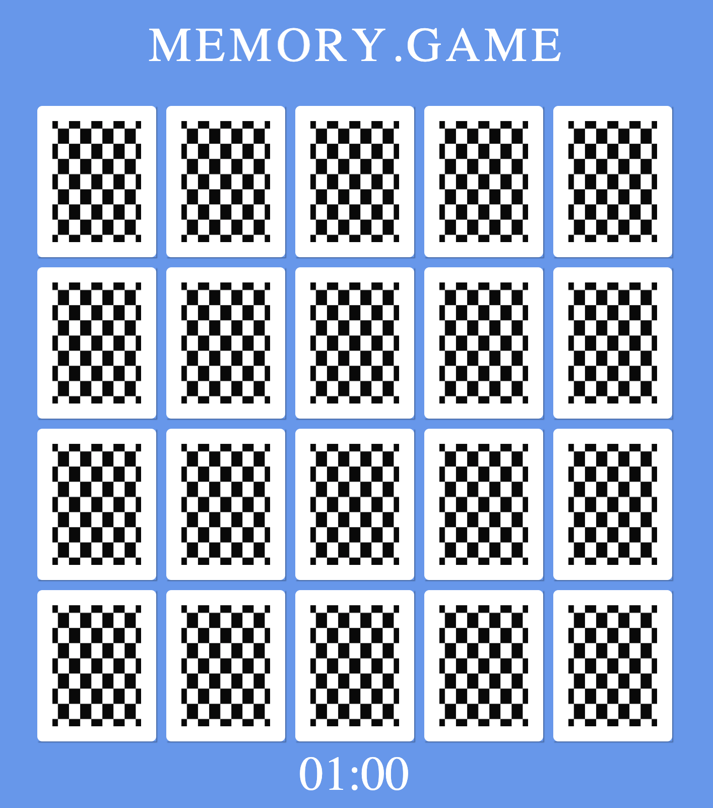

# Memory Game 🃏
Welcome to **Memory Game**! This is a classic memory-matching game where you need to find all the pairs of emojis within 60 seconds. The timer starts as soon as you flip the first card.

## Overview
The objective of the **Memory Game** is to find all the matching pairs of emojis within the given time limit. Flip over two cards at a time to reveal the emojis. If they match, they stay face up; otherwise, they are flipped back over. Your goal is to match all the pairs before the timer runs out!

## Features
- Memory-matching gameplay with emojis
- Timer starts when the first card is flipped
- Utilizes jQuery and event handling for interactivity
- Game restart button functionality is now available

## Known Issues
The end-game section may have a few bugs that could affect the completion status. There's a known issue with the timer not stopping when the player wins the game. Work is ongoing to resolve these issues and ensure a smoother gaming experience.

## Upcoming Features
I'm working on improving the game with the following features:
- Adding a move counter to keep track of player movements
- Introducing multiple difficulty levels to cater to different players

Stay tuned for updates as I continue to improve the game and resolve existing issues!
